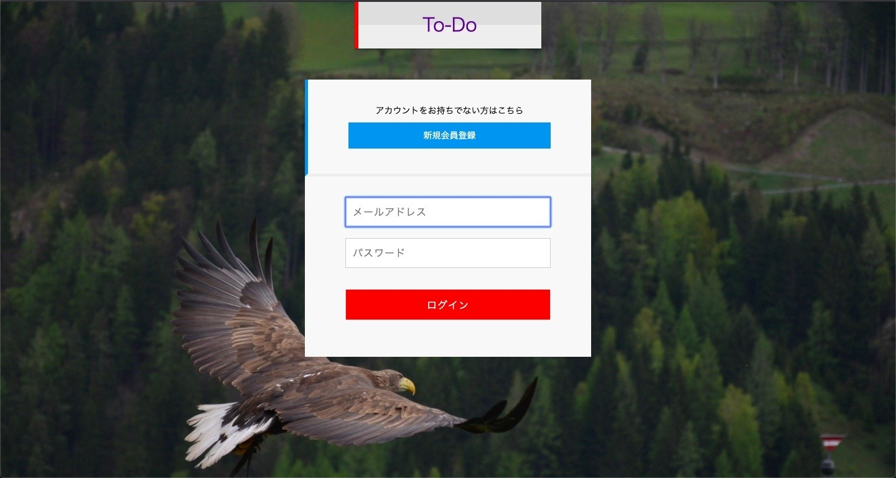
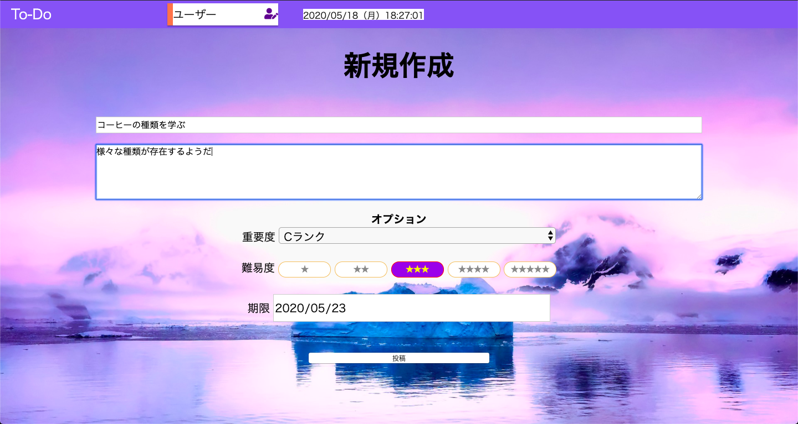
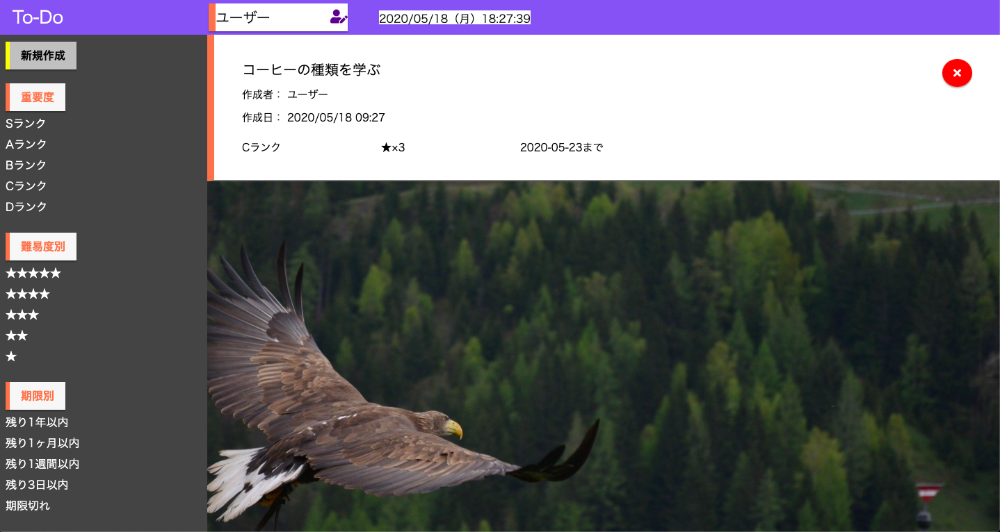

# README

## タイトル
To-Do.Project

#### 旧開発環境
※開発環境変更のため、本リポジトリは以下より以降したものとなっております。 
https://github.com/kashun0410/todoMyApp

### リンク
https://todomyapp-2020.herokuapp.com
（ログインページに遷移します） 
※デプロイ等でアクセスできないタイミングもございます。その時は時間を置いてサイトに接続するようお願いいたします。

## アプリ概要
このアプリは自分のやること(ToDo)を投稿し、管理するアプリとなります。

### このアプリを作ろうかと思ったきっかけ
物事を忘れてしまうことが多く、まずはその備忘録としてやることをリストアップしたアプリを制作使用と思ったのが、直接の理由です。
また、このアプリを制作することによってこれまで学んできた機能の復習になり、機能を拡張することによって新たな学びを得ることができると考えております。

### 使用技術
　　Haml, Scss ,Ruby on Rails, JavaScript, Heroku（デプロイ用）

### 使い方
・ログイン後、トップページの左上に存在する「新規投稿」押下すると、投稿画面に遷移します。

・投稿画面ではtodoのタイトル、詳細を記述することができる枠があり、
　その下にはオプションとして、そのtodoの重要度・難易度・期限を設定することができます。
　（これら全てを入力しなければバリデーションに引っかかってしまいます）

・トップページの投稿したtodoの右上に存在する「×」を押下すると削除することができます。
　削除の確認のポップアップが表示されるため、削除する際はOKを押してください。

## バージョン
Ver.1.0 リリース
　　　　　基本的な機能（ログイン、投稿、削除）

     
## 課題とこれからの実装予定
　Ver.1.0時点ではトップページ右側の難易度、重要度、期限は存在しているのみであるため
 それらはソート用に実装してみたいと思っております。
